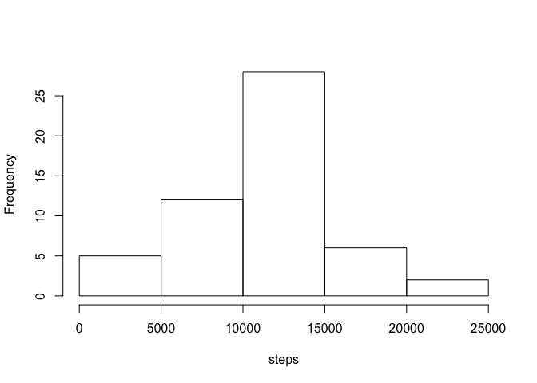
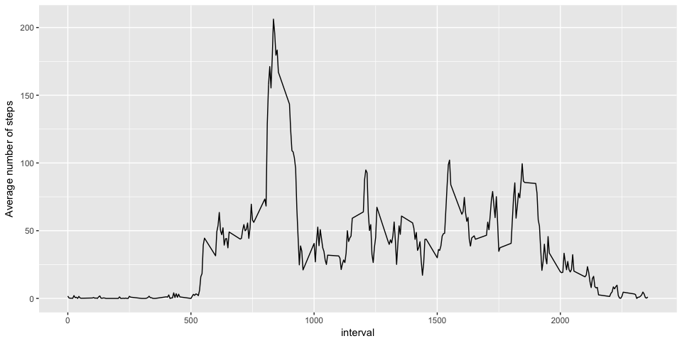
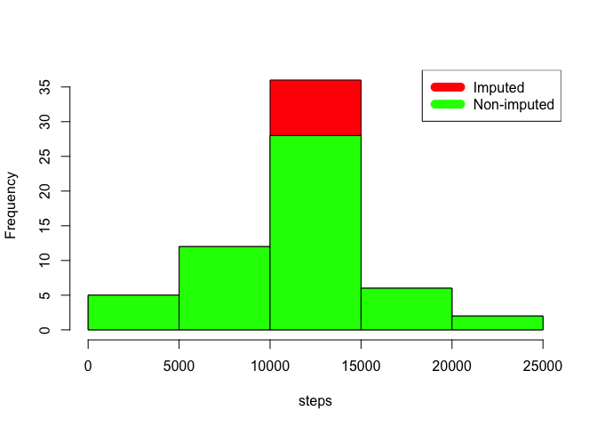
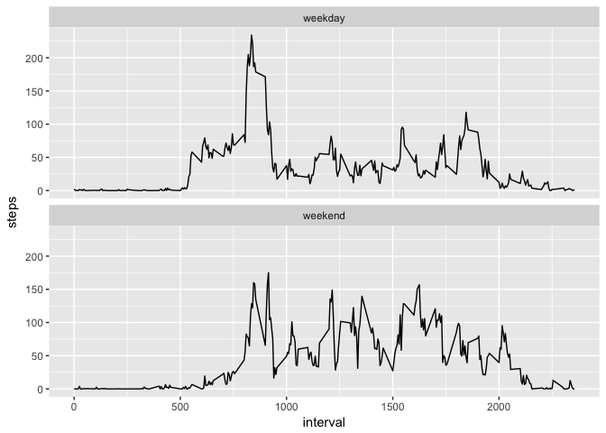

Loading and preprocessing the data
----------------------------------

The following code download the data directly from the link given on the
course website and save it in the R working directory.

The data are stored in the DF "Activity\_Data".

Please note that in this DF the "NAs" have been removed.

                zipUrl <- 'https://d396qusza40orc.cloudfront.net/repdata%2Fdata%2Factivity.zip'
                zipFile = 'activity.zip'
                if (!file.exists(zipFile)){
                    download.file(zipUrl, zipFile, method = 'curl')
                }
                filePath = 'Course_Project_01' 
                if (!file.exists(filePath)){
                    unzip(zipFile)
                }
                
                
                # load activity data
                Activity_Data <- read.csv("activity.csv")
                
                
                Activity_Data <-na.omit(Activity_Data)
                library(lubridate)

    ## 
    ## Attaching package: 'lubridate'

    ## The following object is masked from 'package:base':
    ## 
    ##     date

                Activity_Data$date <- ymd(Activity_Data$date)

This is an overview of the first 10 rows of the DF and its structure:

                head(Activity_Data,10)

    ##     steps       date interval
    ## 289     0 2012-10-02        0
    ## 290     0 2012-10-02        5
    ## 291     0 2012-10-02       10
    ## 292     0 2012-10-02       15
    ## 293     0 2012-10-02       20
    ## 294     0 2012-10-02       25
    ## 295     0 2012-10-02       30
    ## 296     0 2012-10-02       35
    ## 297     0 2012-10-02       40
    ## 298     0 2012-10-02       45

                str(Activity_Data)

    ## 'data.frame':    15264 obs. of  3 variables:
    ##  $ steps   : int  0 0 0 0 0 0 0 0 0 0 ...
    ##  $ date    : Date, format: "2012-10-02" "2012-10-02" ...
    ##  $ interval: int  0 5 10 15 20 25 30 35 40 45 ...
    ##  - attr(*, "na.action")=Class 'omit'  Named int [1:2304] 1 2 3 4 5 6 7 8 9 10 ...
    ##   .. ..- attr(*, "names")= chr [1:2304] "1" "2" "3" "4" ...

What is mean total number of steps taken per day?
-------------------------------------------------

The next chunk of code use the package "dplyr" to store in a new DF
called "Activity\_Data\_day" the total steps per day. This DF is used
afterward to create the Histogram at point 2.

              library(dplyr)

    ## 
    ## Attaching package: 'dplyr'

    ## The following objects are masked from 'package:lubridate':
    ## 
    ##     intersect, setdiff, union

    ## The following objects are masked from 'package:stats':
    ## 
    ##     filter, lag

    ## The following objects are masked from 'package:base':
    ## 
    ##     intersect, setdiff, setequal, union

              Activity_Data_day <-group_by(Activity_Data,date)%>%
                                  arrange(desc(date))%>%
                                  summarize(steps = sum(steps))

This is an extract of the first 10 rows of the DF "Activity\_Data\_day"

              head(Activity_Data_day, 10)

    ## # A tibble: 10 x 2
    ##          date steps
    ##        <date> <int>
    ##  1 2012-10-02   126
    ##  2 2012-10-03 11352
    ##  3 2012-10-04 12116
    ##  4 2012-10-05 13294
    ##  5 2012-10-06 15420
    ##  6 2012-10-07 11015
    ##  7 2012-10-09 12811
    ##  8 2012-10-10  9900
    ##  9 2012-10-11 10304
    ## 10 2012-10-12 17382

              hist(Activity_Data_day$steps, main = NULL , xlab = "steps")

The following code compute the mean and the median of the steps taken
per day.

                steps_mean <- mean(Activity_Data_day$steps)
                steps_mean <- format(steps_mean, scientific = FALSE, digits = 0)
                steps_median <- median(Activity_Data_day$steps)

The mean of steps taken each day is 10766

The median of steps taken each day is 10765

What is the average daily activity pattern?
-------------------------------------------

                Activity_mean_day <-group_by(Activity_Data, interval)%>%
                                    summarize(steps = mean(steps))

                library(ggplot2)

                g <- ggplot(Activity_mean_day, aes(interval,steps)) + geom_line()+
                   
                   labs(y = "Average number of steps")
                print(g)

The next code is used to assess which of the 5-minute interval, on
average across all the days in the dataset, contains the maximum number
of steps.

                Activity_mean_interval <- data.frame()
                temp<-c()
                j=1
                for(i in seq(0,2355, 5)){
                  
                  temp<-  filter(Activity_Data, interval== i)
                  Activity_mean_interval[j,1]<- mean(temp$steps)
                  Activity_mean_interval[j,2] <- i
                  j<-j+1
                  
                }
                
                int_filtered <- filter(Activity_mean_interval, Activity_mean_interval$V1 == max(Activity_mean_interval$V1, na.rm=TRUE))

The 5 minutes interval with the max number of steps is the one with the
indentifier 835 and the associated average number of steps are 206.

Imputing missing values
-----------------------

### 1. Calculate and report the total number of missing values in the dataset

              Activity_Data_imputed <- read.csv("activity.csv")
              Activity_Data_imputed$date <- ymd(Activity_Data_imputed$date)

The dataset contains a total of 2304 NAs values. The total number of
observations is 17568 that means 13% are missing data. Because this is
not a small percentage the effects of missing data on the results needs
to be assessed.

### 2. Devise a strategy for filling in all of the missing values in the dataset.

The following strategy is used for imputing missing data.

If there is a missing data "NA" the mean of the interval to which it
belong is used instead.

### 3. Create a new dataset that is equal to the original dataset but with the missing data filled in

In the following code chunck a for loop and an if are used to replace
all the "NAs" present in the dataset.

                for(i in 1:length(Activity_Data_imputed$steps)){
                    if(is.na(Activity_Data_imputed[i,1])){
                        Activity_Data_imputed[i,1]<- Activity_mean_interval[Activity_Data_imputed[i,3] == 
                                                                      Activity_mean_interval$V2, 1]
                    }
                  
                }

Hereafter are shown the begin and the end of the new dataset
"Activity\_Data" where no "NAs" are present!

                head(Activity_Data_imputed, 10)

    ##        steps       date interval
    ## 1  1.7169811 2012-10-01        0
    ## 2  0.3396226 2012-10-01        5
    ## 3  0.1320755 2012-10-01       10
    ## 4  0.1509434 2012-10-01       15
    ## 5  0.0754717 2012-10-01       20
    ## 6  2.0943396 2012-10-01       25
    ## 7  0.5283019 2012-10-01       30
    ## 8  0.8679245 2012-10-01       35
    ## 9  0.0000000 2012-10-01       40
    ## 10 1.4716981 2012-10-01       45

                tail(Activity_Data_imputed, 10)

    ##           steps       date interval
    ## 17559 0.0000000 2012-11-30     2310
    ## 17560 0.8301887 2012-11-30     2315
    ## 17561 0.9622642 2012-11-30     2320
    ## 17562 1.5849057 2012-11-30     2325
    ## 17563 2.6037736 2012-11-30     2330
    ## 17564 4.6981132 2012-11-30     2335
    ## 17565 3.3018868 2012-11-30     2340
    ## 17566 0.6415094 2012-11-30     2345
    ## 17567 0.2264151 2012-11-30     2350
    ## 17568 1.0754717 2012-11-30     2355

                str(Activity_Data_imputed)

    ## 'data.frame':    17568 obs. of  3 variables:
    ##  $ steps   : num  1.717 0.3396 0.1321 0.1509 0.0755 ...
    ##  $ date    : Date, format: "2012-10-01" "2012-10-01" ...
    ##  $ interval: int  0 5 10 15 20 25 30 35 40 45 ...

As a final check the total number of "NAs" in the dataset is computed
using the function \`sum(is.na(Activity\_Data\_imputed$steps)) is equal
to 0.

### 4. Make a histogram of the total number of steps taken each day and Calculate and report the mean and median total number of steps taken per day.

              Activity_Data_day_i <-group_by(Activity_Data_imputed,date)%>%
                                  arrange(desc(date))%>%
                                  summarize(steps = sum(steps))

              hist(Activity_Data_day_i$steps,col = "red", main = NULL , xlab = "steps")
              
              hist(Activity_Data_day$steps,col = "green", main = NULL , xlab = "steps", add = TRUE)
              
              legend("topright", c("Imputed", "Non-imputed"), col=c("red", "green"), lwd=10)

              steps_mean <- mean(Activity_Data_day_i$steps)
              steps_mean <- format(steps_mean, scientific = FALSE, digits = 0)
              steps_median <- median(Activity_Data_day_i$steps)
              steps_median <- format(steps_median, scientific = FALSE, digits = 0)

The new mean of steps taken each day is 10766

The new median of steps taken each day is 10766.

The strategy used to input the missing values does not produce any
change on the mean and a minimum one on the median.

What is the impact of imputing missing data on the estimates of the
total daily number of steps?

                      Activity_Data_day_2 <-group_by(Activity_Data_imputed,date)%>%
                                                    arrange(desc(date))%>%
                                                    summarize(steps = sum(steps))

                      head(Activity_Data_day_2, 10)

    ## # A tibble: 10 x 2
    ##          date    steps
    ##        <date>    <dbl>
    ##  1 2012-10-01 10766.19
    ##  2 2012-10-02   126.00
    ##  3 2012-10-03 11352.00
    ##  4 2012-10-04 12116.00
    ##  5 2012-10-05 13294.00
    ##  6 2012-10-06 15420.00
    ##  7 2012-10-07 11015.00
    ##  8 2012-10-08 10766.19
    ##  9 2012-10-09 12811.00
    ## 10 2012-10-10  9900.00

                      head(Activity_Data_day, 10)

    ## # A tibble: 10 x 2
    ##          date steps
    ##        <date> <int>
    ##  1 2012-10-02   126
    ##  2 2012-10-03 11352
    ##  3 2012-10-04 12116
    ##  4 2012-10-05 13294
    ##  5 2012-10-06 15420
    ##  6 2012-10-07 11015
    ##  7 2012-10-09 12811
    ##  8 2012-10-10  9900
    ##  9 2012-10-11 10304
    ## 10 2012-10-12 17382

                      summary(Activity_Data_day_2$steps)

    ##    Min. 1st Qu.  Median    Mean 3rd Qu.    Max. 
    ##      41    9819   10766   10766   12811   21194

                      summary(Activity_Data_day$steps)

    ##    Min. 1st Qu.  Median    Mean 3rd Qu.    Max. 
    ##      41    8841   10765   10766   13294   21194

Adding missing values using the above strategy has caused only changes
in the 1st and 3rd Quantiles for the total daily number of steps.

Are there differences in activity patterns between weekdays and weekends?
-------------------------------------------------------------------------

              Activity_Data$daytype <- 0

              for(i in 1:length(Activity_Data$date)){

                if(weekdays(Activity_Data[i,2]) == "Saturday"){
               
                  Activity_Data[i,4] <- "weekend"
                 
                }
                else if(weekdays(Activity_Data[i,2]) == "Sunday"){
               
                  Activity_Data[i,4] <- "weekend"
                 
                }
                else if(weekdays(Activity_Data[i,2]) != "Saturday"){
                  Activity_Data[i,4] <- "weekday"
                }
                else if(weekdays(Activity_Data[i,2]) != "Sunday"){
                  Activity_Data[i,4] <- "weekday"
                }
              }

              
              
              Activity_Data$daytype <- as.factor(Activity_Data$daytype)
              
              Activity_Data <-group_by(Activity_Data, interval, daytype)%>%
                                  summarize(steps = mean(steps))
              
             
              p <- ggplot(Activity_Data, aes(interval, steps)) +
                geom_line() + facet_wrap(~daytype, nrow = 2, ncol = 1)
              
              print(p)

